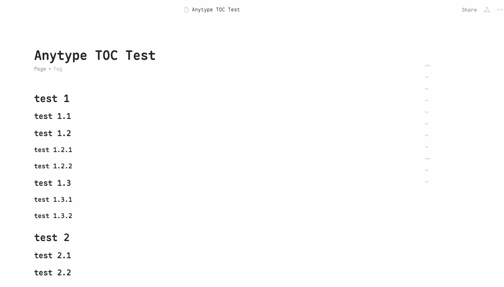

[中文](../README.md) | [English](README_en-US.md) | [繁體中文](README_zh-TW.md) | [Русский](README_ru-RU.md) | [日本語](README_ja-JP.md) | [한국어](README_ko-KR.md) | [Deutsch](README_de-DE.md) | [Français](README_fr-FR.md)

# Anytype Floating Table of Contents

## Project Background
Since 2022, Anytype community users have been advocating for the addition of a floating table of contents feature. Unfortunately, as of April 2025, this feature has not yet been included in the official development roadmap. Interestingly, Notion, one of Anytype's main competitors, has also shown little enthusiasm for implementing this feature.

## Solution
This project implements a clean and elegant floating table of contents for Anytype using custom CSS. This solution aligns with the approach shared by community user [@sandroid](https://community.anytype.io/t/custom-table-of-contents-custom-css/27360/8).

In the design process, we drew inspiration from the floating table of contents style of sspai.com. Despite Anytype's limitation of only supporting custom CSS without JS, the final result is still impressive.

## Demo

## Features
- Clean and elegant floating table of contents layout
- Table of contents follows page scroll for easy navigation
- Hover effects for table of contents items

## Usage
1. Open Anytype and navigate to `File -> Open -> Custom CSS`
2. Copy the contents of `custom.css` or `custom.min.css` into the `Custom CSS` file
3. Restart Anytype to apply the changes

## Notes
- For custom styling, you can modify the parameters in `custom.css` 