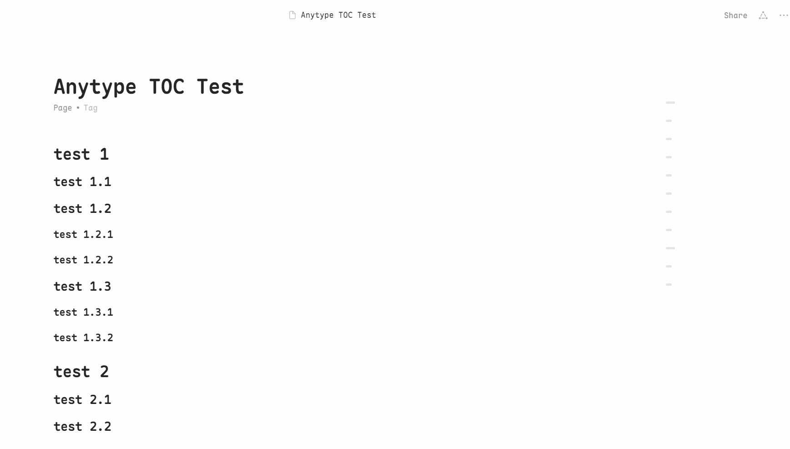

[中文](../README.md) | [English](README_en-US.md) | [繁體中文](README_zh-TW.md) | [Русский](README_ru-RU.md) | [日本語](README_ja-JP.md) | [한국어](README_ko-KR.md) | [Deutsch](README_de-DE.md) | [Français](README_fr-FR.md)

# Anytype 懸浮目錄

## 專案背景
自 2022 年起，Anytype 社群用戶就一直在呼籲添加懸浮目錄功能。遺憾的是，截至 2025 年 4 月，這個功能仍未在官方開發計劃中。有趣的是，Notion 作為 Anytype 的主要競品之一，在實現懸浮目錄功能時積極性也不高。

## 解決方案
本專案通過自定義 CSS 的方式，為 Anytype 實現了一個簡潔優雅的懸浮目錄功能。這個解決方案與社群用戶 [@sandroid](https://community.anytype.io/t/custom-table-of-contents-custom-css/27360/8) 的思路不謀而合。

在設計過程中，參考了少數派（[sspai.com](https://sspai.com)）網站的懸浮目錄風格。受 Anytype 只支援自定義 CSS 而不支援 JS 的限制，雖無法實現 100% 的還原，但最終效果依然非常棒。

## 效果展示

## 功能特點
- 簡潔優雅的懸浮目錄佈局設計
- 目錄跟隨頁面滾動，提供便捷導航
- 支援目錄項懸停效果

## 使用方法
1. 打開 Anytype，依次點擊 `檔案 -> 開啟 -> 自定義 CSS`
2. 將 `custom.css` 或 `custom.min.css` 的內容複製到 `自定義 CSS` 檔案中
3. 重啟 Anytype 即可生效

## 注意事項
- 如需自定義樣式，可以修改 `custom.css` 中的相關參數 